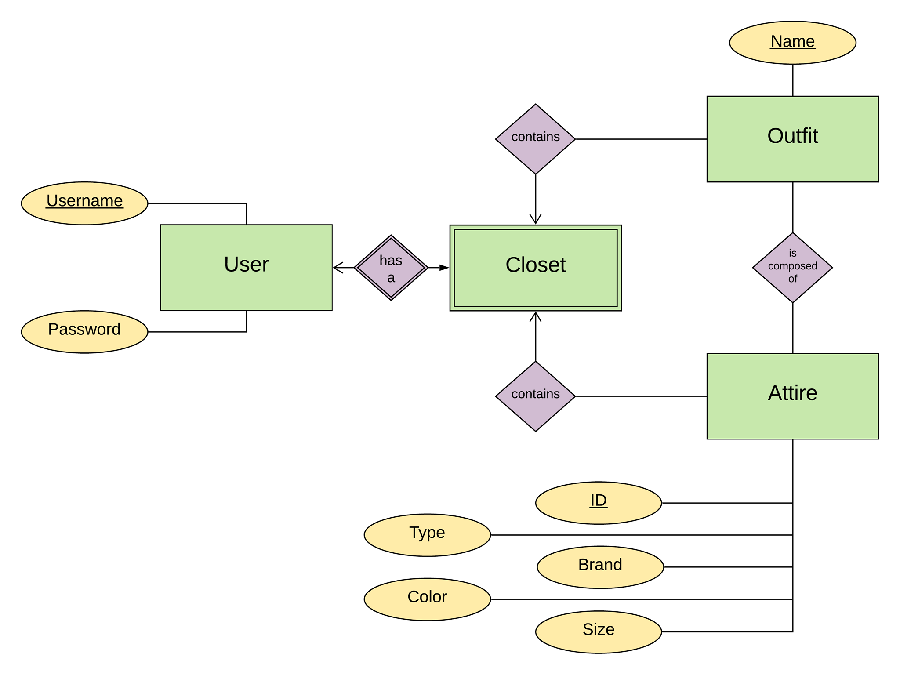

# whatdoiwear.today - Project Data Model and Database Design v1

## Entity / Relationship Diagram

## Entity Set Descriptions

### User

The User entity set has two attributes: username and password. The key of a User is the username. The User entity set consists of users of the application and their login information.

### Closet

The Closet is a weak entity set that has no attributes. The key of a Closet is the username of the User. The Closet entity set consists of a collection of clothing pieces the users save as outfits (multiple clothing pieces) or as attire (individual clothing pieces).

### Outfit

The Outfit entity set has one attribute: name. The key of an Outfit is the name. The Outfit entity set consists of clothing pieces that the users save as outfits.

### Attire

The Attire entity set has five attributes: ID, type, brand, color, and size. The key of an Attire is the ID. The Attire entity set consists of all the individual clothing pieces the users save.

## Relationship Descriptions

### User "has a" Closet

A User has zero or one Closet(s), but a Closet has exactly one User. A User may exist without a Closet, but a Closet cannot exist without a User. Hence, the User "has a" Closet relationship is supporting, many-one relationship.

### Closet "contains" Outfit(s)

A Closet contains zero or more outfits, whereas an outfit is related to exactly one User's Closet.

### Closet "contains" Attire

A Closet contains zero or more pieces of attire, whereas a piece of attire is related to exactly one User's Closet.

### Outfit "is composed of" Attire

An Outfit is composed of one or more pieces of Attire.
