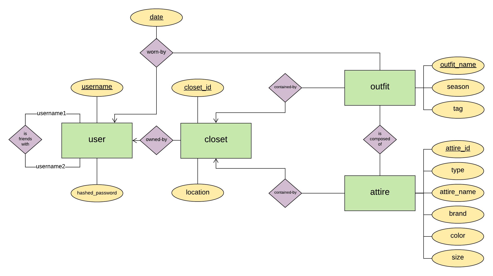
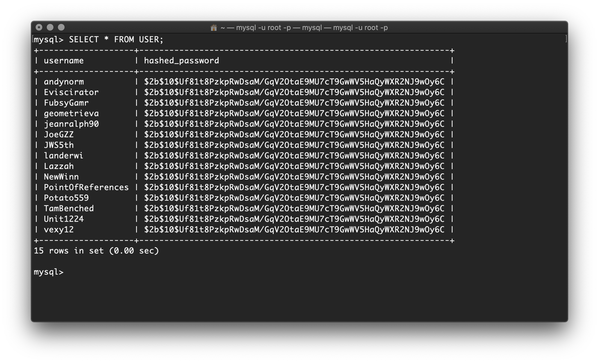
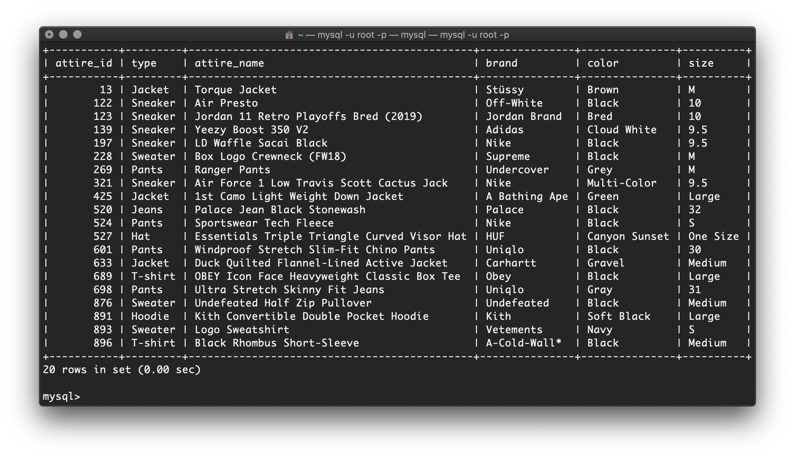
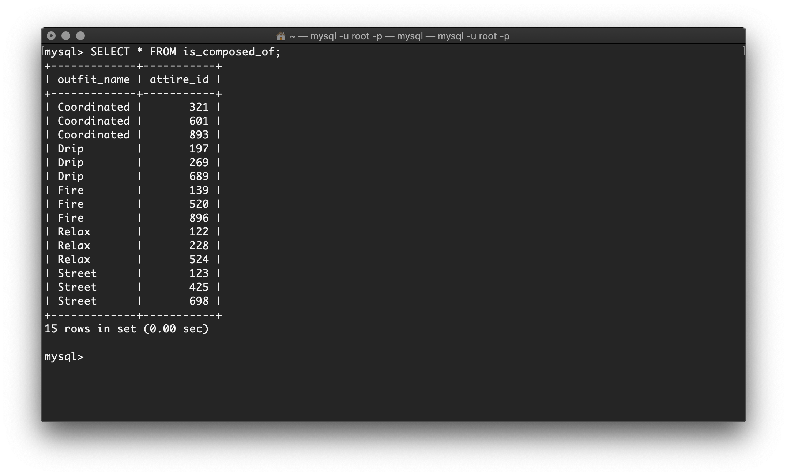

# whatdoiwear.today - Project Data Model and Database Design v3

## Entity / Relationship Diagram TODO

## Entity Set Descriptions

### user

User is an entity set with two attributes: a unique username and password. They key of user is username. The user entity set represents users of the application and their login information.

### closet

Closet is an entity set corresponding to a users's physical closet. The key of a closet is closet_id. The closet entity set consists of a collection of clothing the users save as outfits (multiple clothing pieces) or as attire (individual clothing pieces).

### outfit

The outfit entity set has three attributes: a unique name, a season, and a tag. The key of an outfit is outfit_name. The outfit entity set consists of "mini-collections" of clothing pieces that the users save as outfits. The tag allows a user to organize different outfits into groups.

### attire

The attire entity set has six attributes: attire_id, type, name, brand, color, and size. The key of a piece of attire is attire_id. The attire entity set consists of all the individual clothing pieces the users save.

## Relationship Descriptions

### closet "owned_by" user

Many closets are owned by one user (many-one from closet to user).

### "outfit_contained_by_closet"

Many outfits are contained by one closet (many-one from outfits to closet).

### "attire_contained_by_closet"

Many pieces of attire are contained by one closet (many-one from attire to closet).

### outfit "is_composed_of" attire

Many outfits are composed of many pieces of attire (many-many from outfit to attire).

### outfit "worn_by" user

Many outfits are worn by one user, with one outfit per date (many-one from outfit to user).

### user1 "is_friends_with" user2

Many users can be friends with many (other) users (many-many from user1 to user2).

## Database Schema

### Entity Sets

- user (<ins>username</ins>, hashed_password)

- closet (<ins>closet_id</ins>, location)

- outfit (<ins>outfit_name</ins>, season, tag)

- attire (<ins>attire_id</ins>, type, attire_name, brand, color, size)

### Relationships

- owns (<ins>closet_id</ins>, username)

- outfit_contained_by_closet (<ins>outfit_name</ins>, closet_id)

- attire_contained_by_closet(<ins>attire_id</ins>, closet_id)

- is_composed_of (<ins>outfit_name</ins>, <ins>attire_id</ins>)

- worn_by (<ins>outfit_name</ins>, <ins>date</ins>, username)

- is_friends_with (<ins>username1</ins>, <ins>username2</ins>)

### BCNF Analysis

| Relation Name              | Relation Set                                | Non-Trivial Functional Dependencies     | Left-Hand Side Superkey? | BCNF?            |
| -------------------------- | ------------------------------------------- | --------------------------------------- | ------------------------ | ---------------- |
| user                       | {U, H}                                      | U &rarr; H                              | Yes                      | Yes              |
| closet                     | {C, L}                                      | C &rarr; L                              | Yes                      | Yes              |
| outfit                     | {O, S, T}                                   | O &rarr; ST                             | Yes                      | Yes              |
| attire                     | {AID, T, AN, B, C, S} | AID &rarr; TANBCS | Yes                      | Yes              |
| owns                       | {C, U}                                      | C &rarr; U                              | Yes                      | Yes              |
| outfit_contained_by_closet | {C, O}                                      | C &rarr; O                              | Yes                      | Yes              |
| attire_contained_by_closet | {C, A}                                      | C &rarr; A                              | Yes                      | Yes              |
| is_composed_of             | {O, A}                                      | (none)                                  | N/A                      | Yes (by default) |
| worn_by                    | {O, D, U}                                   | OD &rarr; U                             | Yes                      | Yes              |
| is_friends_with            | {U1, U2}              | (none)                                  | N/A                      | Yes (by default) |

## Tables TODO

### Entity Set Tables

- user
  
- closet
  
- outfit
  
- attire
  

### Relationships Tables

- owns
  
- closet_contains_outfit
  
- closet_contains_attire
  
- is_composed_of
  
- wears
  
- is_friends_with
  
