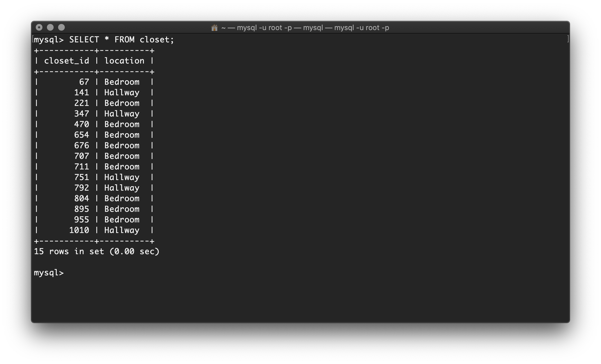
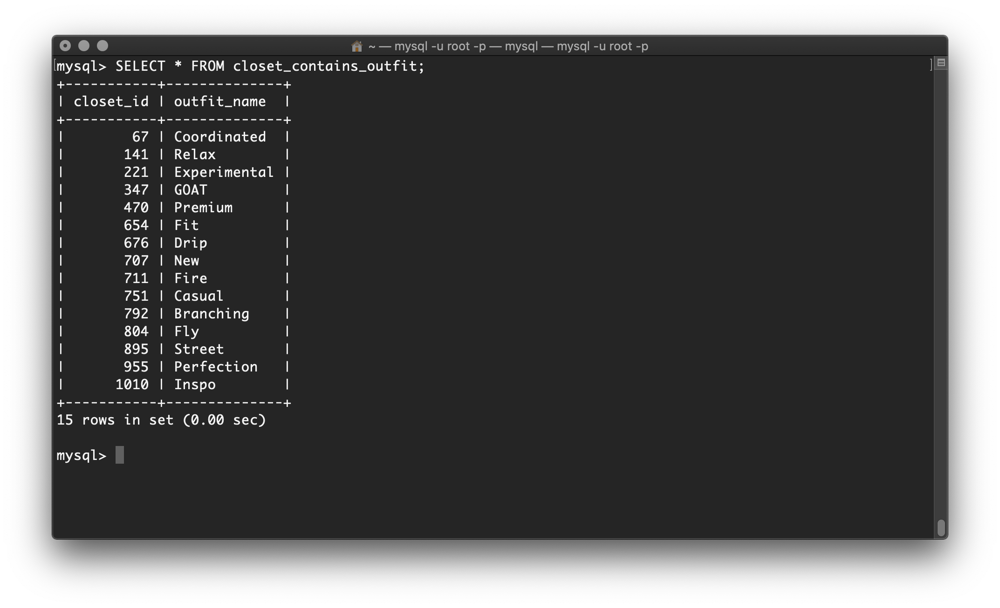
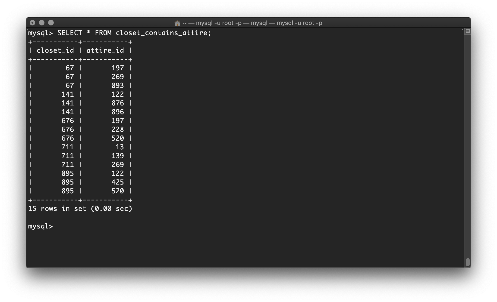

# whatdoiwear.today - Project Data Model and Database Design v3

## Entity / Relationship Diagram

## Entity Set Descriptions

### user

User is an entity set with three attributes: a unique id, a unique username and password. They key of user is user_id. The user entity set represents users of the application and their login information.

### closet

Closet is an entity set corresponding to a users's physical closet. The key of a closet is closet_id. The closet entity set consists of a collection of clothing the users save as outfits (multiple clothing pieces) or as attire (individual clothing pieces).

### outfit

The outfit entity set has three attributes: a unique name, a season, and a tag. The key of an outfit is outfit_name. The outfit entity set consists of "mini-collections" of clothing pieces that the users save as outfits. The tag allows a user to organize different outfits into groups.

### attire

The attire entity set has six attributes: attire_id, type, name, brand, color, and size. The key of a piece of attire is attire_id. The attire entity set consists of all the individual clothing pieces the users save.

## Relationship Descriptions

### user "owns" closet

A user owns zero to many closet(s), but a closet is owned by exactly one User. A user may exist without a closet, but a closet cannot exist without a user.

### "closet_contains_outfit"

A closet contains zero to many outfits, whereas an outfit is contained in to exactly one user's closet.

### "closet_contains_attire"

A closet contains zero to many pieces of attire, whereas a piece of attire is contained in exactly one user's closet.

### outfit "is_composed_of" attire

An outfit is composed of one or more pieces of attire.

### user "wears" outfit

A user wears zero to many outfits, with one outfit per date. 

### user "is_friends_with" (another) user

A user can have zero to many friends.

## Database Schema

### Entity Sets

* user (<ins>user_id</ins>, username, hashed_password)
* closet (<ins>closet_id</ins>, location)
* outfit (<ins>outfit_name</ins>, season, tag)
* attire (<ins>attire_id</ins>, type, name, brand, color, size)

### Relationships

* owns (<ins>closet_id</ins>, username)
* closet_contains_outfit (<ins>closet_id</ins>, <ins>outfit_name</ins>)
* closet_contains_attire (<ins>closet_id</ins>, <ins>attire_id</ins>)
* is_composed_of (<ins>outfit_name</ins>, <ins>attire_id</ins>)
* wears (<ins>username</ins>, <ins>outfit_name</ins>, <ins>date</ins>)
* is_friends_with (<ins>username1</ins>, <ins>username2</ins>)

## Tables

### Entity Set Tables

* user

* closet

* outfit

* attire

### Relationships Tables

* owns

* closet_contains_outfit

* closet_contains_attire

* is_composed_of

* wears

* is_friends_with
