# whatdoiwear.today - Project Data Model and Database Design Revision

## Entity / Relationship Diagram

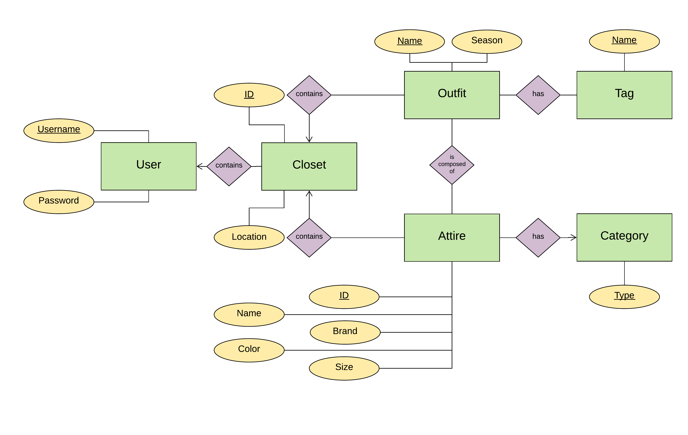

## Entity Set Descriptions

### User

User is an entity set with two attributes: a unique username and password. They key of User is the username attribute. The User entity set represents users of the application and their login information.

### Closet

Closet is an entity set corresponding to a User's physical closet. The key of a Closet is the ID attribute. The Closet entity set consists of a collection of clothing the users save as outfits (multiple clothing pieces) or as attire (individual clothing pieces).

### Outfit

The Outfit entity set has two attributes: a unique name and a season. The key of an Outfit is the name. The Outfit entity set consists of "mini-collections" of clothing pieces that the users save as outfits.

### Attire

The Attire entity set has five attributes: ID, name, brand, color, and size. The key of an Attire is the ID. The Attire entity set consists of all the individual clothing pieces the users save.

### Category

The Category entity set has one attribute: type. This entity set serves to categorize pieces of Attire into types such as T-shirts, pants, etc.

## Relationship Descriptions

### User "owns a" Closet

A User owns zero to many Closet(s), but a Closet is owned by exactly one User. A User may exist without a Closet, and a Closet cannot exist without a User.

### Closet "contains" Outfit(s)

A Closet contains zero to many outfits, whereas an outfit is contained in to exactly one User's Closet.

### Closet "contains" Attire

A Closet contains zero to many pieces of Attire, whereas a piece of Attire is contained in exactly one User's Closet.

### Outfit "is composed of" Attire

An Outfit is composed of one or more pieces of Attire.

### Attire "has a" Type

An piece of Attire has exactly one Category type (e.g. sweater, shoes), whereas a Category type is encompossed by zero to many piece(s) of Attire.

### Outfit "has a" Tag

In order to allow for the user to add more relevant information to an Outfit for filtering purposes, a User may associate an Outfit with zero to many Tag(s), whereas a Tag may be associated with zero to many Outfit(s).

## Database Schema

### Entity Sets

* User (<ins>username</ins>, password)
* Closet (<ins>ID</ins>, location)
* Outfit (<ins>name</ins>, season)
* Attire (<ins>ID</ins>, name, brand, color, size)
* Category (<ins>type</ins>)
* Tag (<ins>name</ins>)

### Relationships

* Owns (username, closetID)
* closetContainsOutfit (closetID, outfitName)
* closetContainsAttire (closetID, attireID)
* IsComposedOf (outfitName, attireID)
* attireHasAType (attireID, type)
* outfitHasATag (outfitName, tagName)

## Tables

### Entity Set Tables

* User
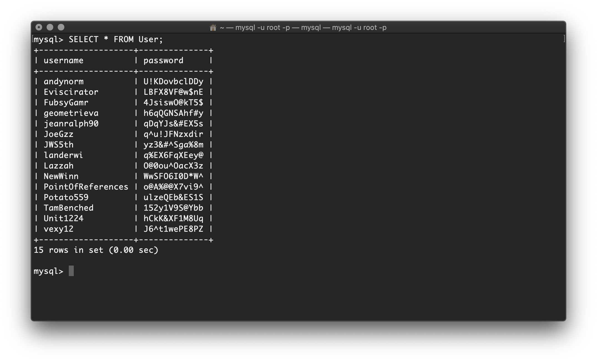
* Closet
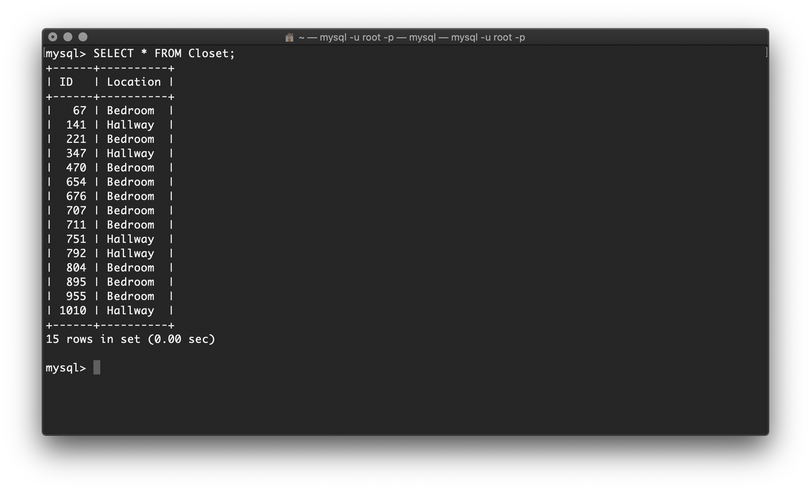
* Outfit
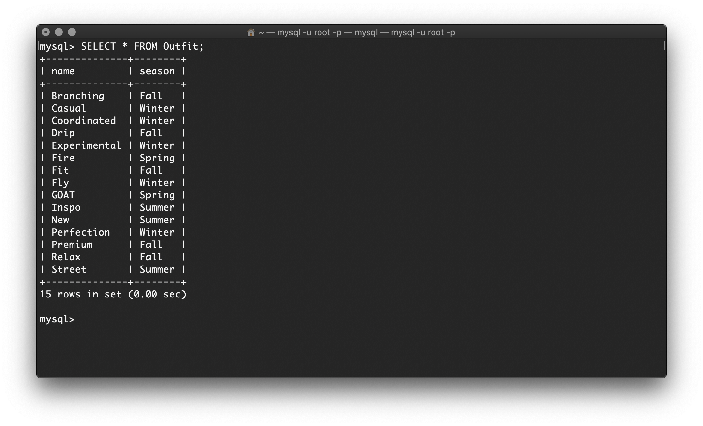
* Attire
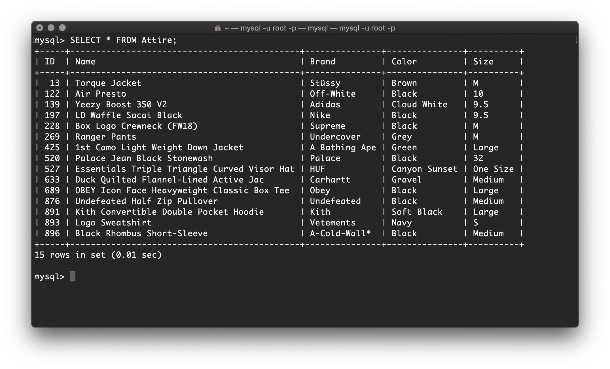
* Category
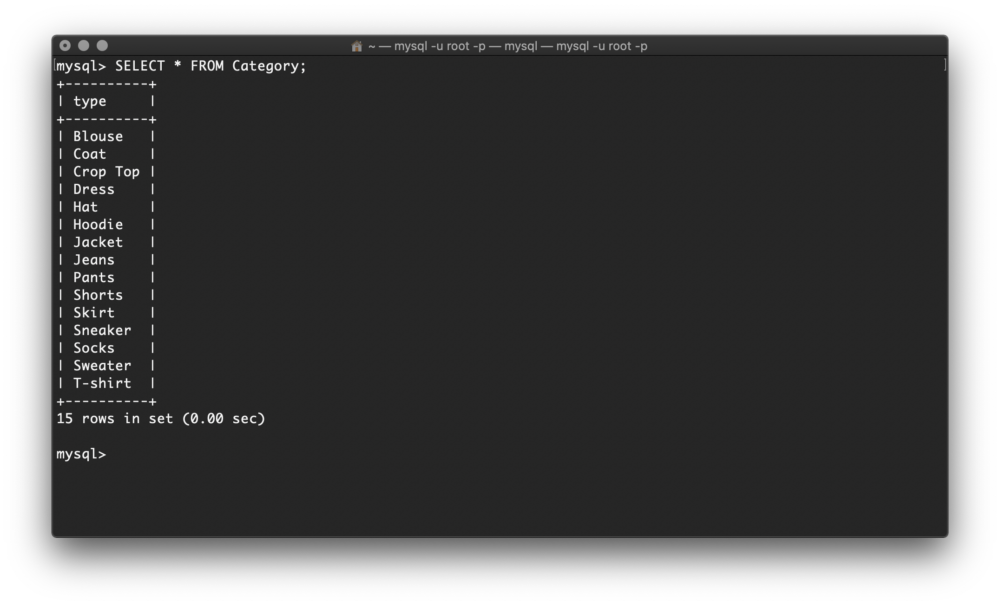
* Tag
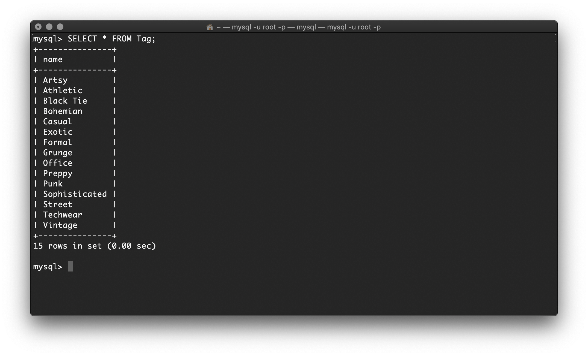

### Relationships Tables

* Owns
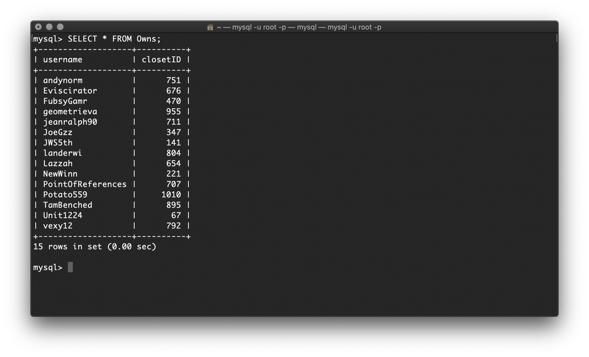
* closetContainsOutfit
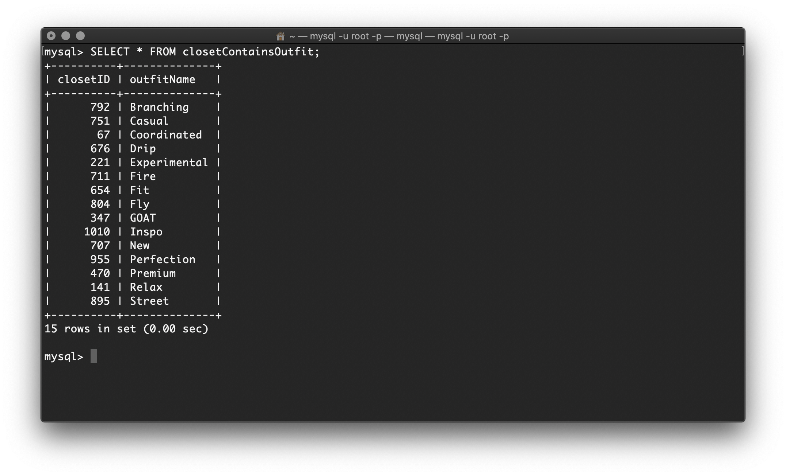
* closetContainsAttire
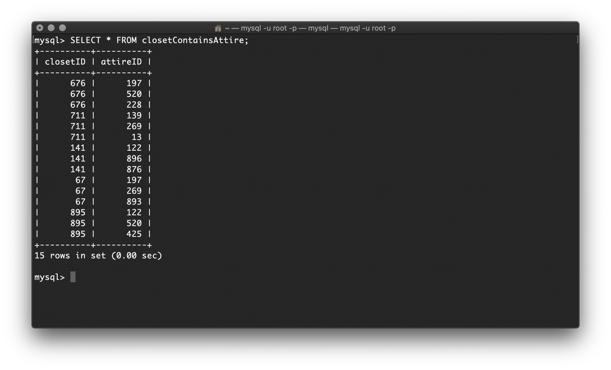
* IsComposedOf
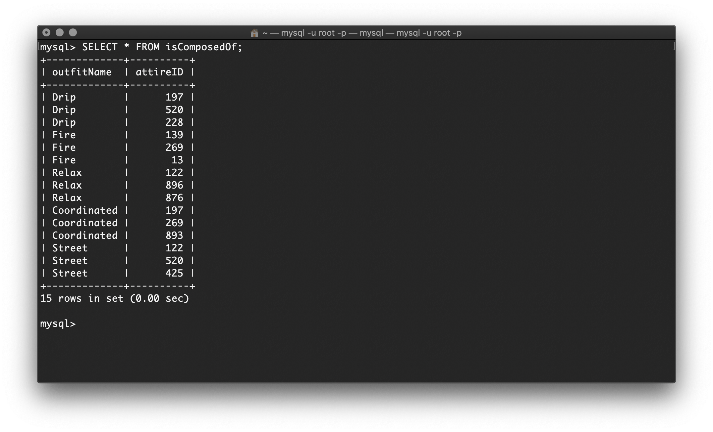
* attireHasAType
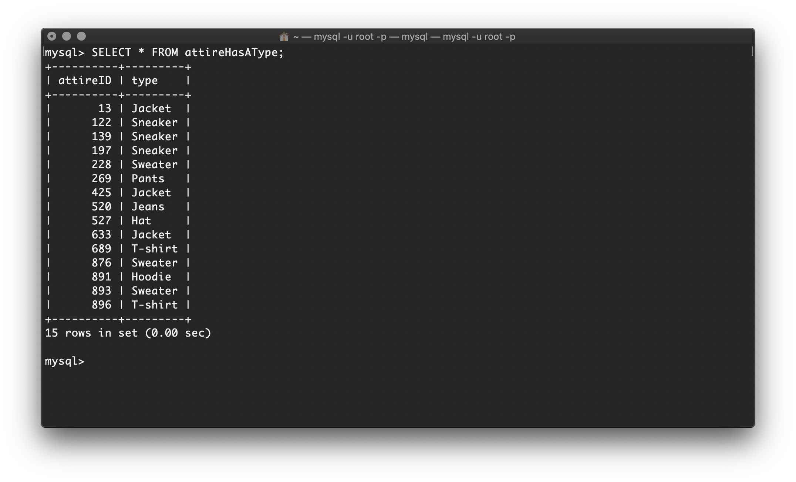
* outfitHasATag
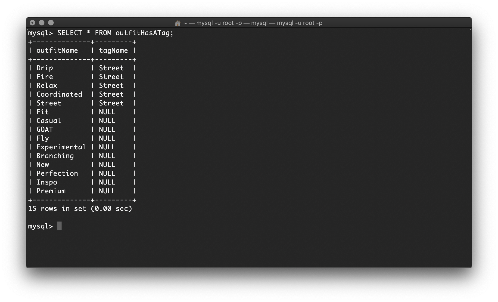
