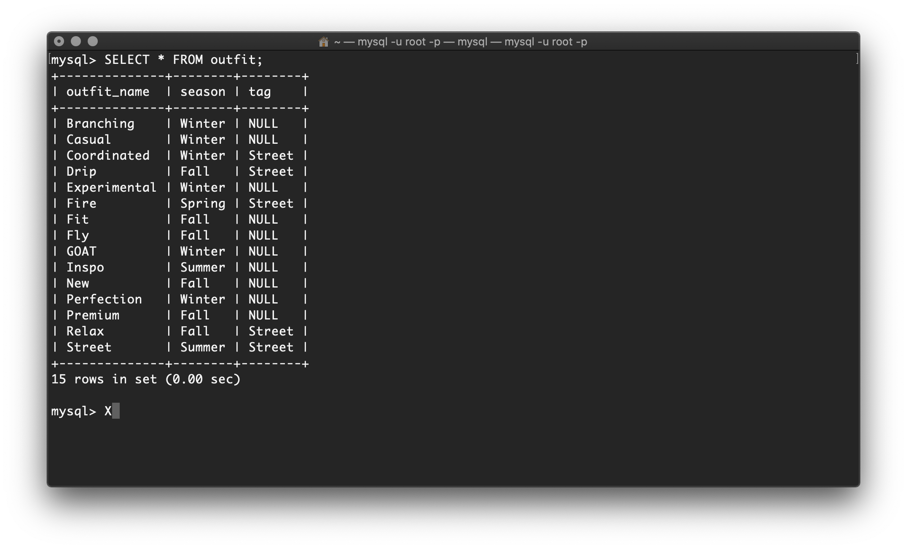
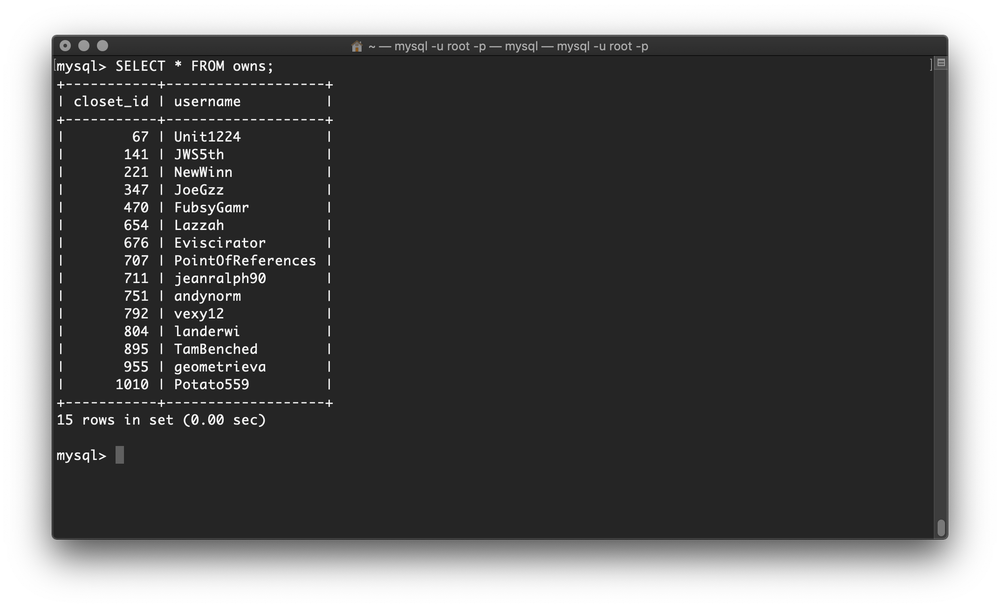
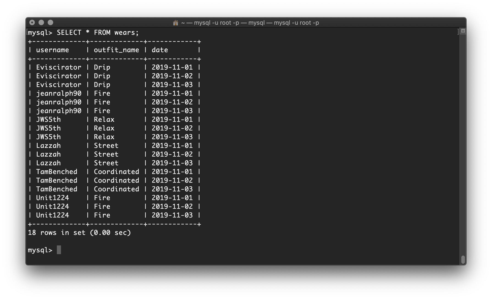
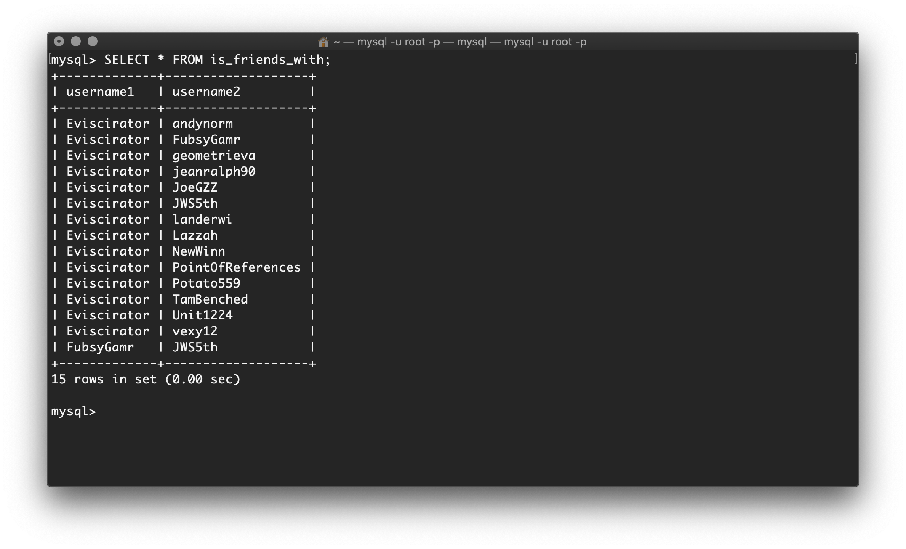

# whatdoiwear.today - Final Report

## Team 21

- [Devin Gonzales](https://github.com/DJGonzales96)
- [Claire Lin](https://github.com/clairelin23)
- [Patrick Silvestre](https://github.com/pjsilvestre)

# Requirements

## Project Description in Detail

### Goal

The goal of this project was to create a user-friendly application capable of
providing users with a convenient way to collect, organize and share various
articles of clothing in an ever growing market of apparel. Users are presented
with collection and sorting functionality in their closets via a GUI.

### Motivation

This project was inspired by an absence in similar applications among the
industry. Music, TV, and literature are all examples of domains with limitless
streaming, collection and sharing capabilities. The fashion industry is a
comparably large source of income expenditure among multiple demographics
with very limited technical representation. This application seeks to bring
similar functionality of other social media or streaming services by allowing
users to collect (and eventually share) their favorite clothing items and brands
in an easy manner.

### Stakeholders

- Students / Young Adults; Women; Professionals

  - This demographic has the desire to maintain a fashionable appearance.

  - In addition, they often have physical closets and often look for ways reduce
    time spent on outfit planning.

- Project Team

  - The team is concerned with creating and maintaining the app as necessary.

### Application Domain

This application is based in the fashion and clothing domain.

### User Benefits

- Clear Clothing Organization

  - Users will be able to come up with outfit ideas more conveniently as they
    can clearly view their entire closet.

  - Users will no longer need to go through the steps of pulling out a piece of
    clothing from a physical closet, trying to pair it with another piece, and
    putting it back if not satisfied with the pairing. Instead, users can create
    outfits via their virtual closet.

- Reduced Spending on Clothing

  - Users will be able to avoid buying clothing similar to the ones they already
    own. The application provides an easy and organized view of the user's
    entire
    clothing collection.

## System Environment in Detail

### Structure

### Hardware/Software

- Development Operating Systems

  - macOS Mojave / Catalina

  - Windows 10

- IDEs / Text Editors

  - Eclipse IDE for Java EE

  - Visual Studio Code

### RDBMS

- MySQL 8.0.17

### Web Server, Middleware, Dependencies

- Node.js

- Express

- mysql

  - Node.js driver for MySQL

- express-session

  - session handling

- passport

  - user authentication

- bcrypt

  - password hashing

* Bootstrap

  - UI elements

### Languages

- HTML (via Pug templating engine)

- CSS

- JavaScript

## Functional Requirements in Detail

### Account Creation and Login

- New users can register for accounts.

- New accounts are persisted in the database.

- Returning users can log in to their accounts provided correct credentials.

### Adding Attire

- Users can add a piece of attire to their closet

- Users can enter text descriptions of the attire, such as type,
  brand, color, and size.

- The application stores this piece of attire and all relevant information
  in the database.

### Viewing Attire

- Users can view the attire in their closet in a list format. Additionally,
  users can sort attire in their closet based on certain attributes (e.g brand).

### Updating Attire

- Users can edit the information for existing attire in their closet.

- The application persists this edited information in the database.

### Removing Attire

- Users can remove existing attire from their closet.

- The application successfully deletes the selected piece from the database..

### Adding Outfits

- Users can organize attire into outfits, primarily based on an outfit name.

### Viewing Outfits

- Similar to viewing attire, users can also view their outfits in their closet.

### Removing Outfits

- Users can remove outfits from their closet.

### Adding Worn Entries

- Users can record an outfit they wore on a certain day.

### Viewing Worn Entries

- Users can view a history of outfits they wore over time.

### Removing Worn Entries

- Users can remove worn entries.

### Adding Friends

- Users can add other users to their friendlist. This functionality is more akin
  to "following" in other social networks, rather than actual "friending".

### Viewing Friends

- Users can view their friendlist, and their friends' outfits.

### Removing Friends

- Users can remove friends.

## Non-Functional Issues in Detail

### Graphical User Interface

The team strove to create an aesthetic graphical user interface that aims to
exhibit the best qualities of user interface design, from clarity to
consistency. The front end was built in HTML via the Pug templating engine, and
heavily utilized the CSS library Bootstrap.

- Account Creation and Login

  - Upon opening the app, the user can navigate to an account creation page or
    login page.

    - The account creation form prompts the user to input a username and
      password.

    - The login form is similar to the account creation form.

  - After successful login, the user is presented with the home page with their
    name and a navigation bar to navigate the app.

- Viewing the Closet

  - The user can freely browse their closets, with pieces represented via text.

- Adding, Updating, and Removing Attire

  - The navigation bar features options for adding, updating, and removing
    attire.

  - When the user chooses to add a new piece, the app presents an
    easy-to-use form, allowing for user input.

  - When updating pieces, the app presents current information on a piece.

### Security

We aim to ensure that a given user can see only their closet, and that a given
closet can only be seen by its respective user. This is implemented through
user authentication and sessions.

# Design

## Entity / Relationship Diagram

## Entity Set Descriptions

### user

- User is an entity set with two attributes: a unique username and password. They key of user is username. The user entity set represents users of the application and their login information.

### closet

- Closet is an entity set corresponding to a users's physical closet. The key of a closet is closet_id. The closet entity set consists of a collection of clothing the users save as outfits (multiple clothing pieces) or as attire (individual clothing pieces).

### outfit

- The outfit entity set has three attributes: a unique name, a season, and a tag. The key of an outfit is outfit_name. The outfit entity set consists of "mini-collections" of clothing pieces that the users save as outfits. The tag allows a user to organize different outfits into groups.

### attire

- The attire entity set has six attributes: attire_id, type, name, brand, color, and size. The key of a piece of attire is attire_id. The attire entity set consists of all the individual clothing pieces the users save.

## Relationship Descriptions

### closet "owned_by" user

- Many closets are owned by one user (many-one from closet to user).

### "outfit_contained_by_closet"

- Many outfits are contained by one closet (many-one from outfits to closet).

### "attire_contained_by_closet"

- Many pieces of attire are contained by one closet (many-one from attire to closet).

### outfit "is_composed_of" attire

- Many outfits are composed of many pieces of attire (many-many from outfit to attire).

### outfit "worn_by" user

- Many outfits are worn by one user, with one outfit per date (many-one from outfit to user).

### user1 "is_friends_with" user2

- Many users can be friends with many (other) users (many-many from user1 to user2).

## Database Schema

### Entity Sets

- user (<ins>username</ins>, hashed_password)

- closet (<ins>closet_id</ins>, location)

- outfit (<ins>outfit_name</ins>, season, tag)

- attire (<ins>attire_id</ins>, type, attire_name, brand, color, size)

### Relationships

- owned_by (<ins>closet_id</ins>, username)

- outfit_contained_by_closet (<ins>outfit_name</ins>, closet_id)

- attire_contained_by_closet (<ins>attire_id</ins>, closet_id)

- is_composed_of (<ins>outfit_name</ins>, <ins>attire_id</ins>)

- worn_by (<ins>outfit_name</ins>, <ins>date</ins>, username)

- is_friends_with (<ins>username1</ins>, <ins>username2</ins>)

### BCNF Analysis

| Relation Name              | Relation Set                                | Non-Trivial Functional Dependencies     | Left-Hand Side Superkey? | BCNF?            |
| -------------------------- | ------------------------------------------- | --------------------------------------- | ------------------------ | ---------------- |
| user                       | {U, H}                                      | U &rarr; H                              | Yes                      | Yes              |
| closet                     | {C, L}                                      | C &rarr; L                              | Yes                      | Yes              |
| outfit                     | {O, S, T}                                   | O &rarr; ST                             | Yes                      | Yes              |
| attire                     | {AID, T, AN, B, C, S} | AID &rarr; TANBCS | Yes                      | Yes              |
| owned_by                   | {C, U}                                      | C &rarr; U                              | Yes                      | Yes              |
| outfit_contained_by_closet | {C, O}                                      | C &rarr; O                              | Yes                      | Yes              |
| attire_contained_by_closet | {C, A}                                      | C &rarr; A                              | Yes                      | Yes              |
| is_composed_of             | {O, A}                                      | (none)                                  | N/A                      | Yes (by default) |
| worn_by                    | {O, D, U}                                   | OD &rarr; U                             | Yes                      | Yes              |
| is_friends_with            | {U1, U2}              | (none)                                  | N/A                      | Yes (by default) |

## Tables

### Entity Set Tables

- user
  
- closet
  
- outfit
  
- attire
  

### Relationships Tables

- owns
  
- closet_contains_outfit
  
- closet_contains_attire
  
- is_composed_of
  
- wears
  
- is_friends_with
  

# Implementation

TODO

# Conclusion

## Team Retrospective

Devin Gonzales

- This project served as a challenging introduction into full-stack development
  with the inclusion of both front-end and back-end components. Developing in
  JavaScript utilizing Node.js and Express has taught me a lot about server-side
  design and the difficulties that come with not only ensuring complete
  functionality of a web application but also designing an effective UI for a
  client. I learned first-hand the role of a database in the back-end of an
  application as well as how databases interact with the server to bring
  functionality to an application. My experience with this project has also
  given me an acute disdain for Node's package manager and the challenges
  that come with debugging npm. Despite these challenges, this project has
  provided an opportunity for me and my team to grow as programmers and gain
  experience developing applications.

Claire Lin

- Through this project, I learned programming languages such as HTML, Node.JS, 
  mySQL, and frameworks for full-stack web development. I also gained a valueable 
  lesson in teamwork. I learned that constant communicate with the team is 
  especially important when everyone has a busy schedule and that the programming 
  langauges we were using were new to us. I was not very active in comminicating 
  because I always felt that I had to make progress before I could update my 
  teammates. If I ever got stuck, I would keep working and not update my teammates 
  about my problems. I, later, realized that not constatnly updating my team about 
  my progress can resulted in my team confused about my progress and worried if the 
  project can be completed by deadlines. Now, I try to update my team on any problems 
  I faced or progress made. Besides, I learned that having respect towards each 
  others' work is essential to maintaining good work spirit. I felt that I am not as 
  proficient in the HTML and Node.JS as my teamates are. But, whenever I made a 
  commit, my teammates would affirm my work, which encourages and motivates me to 
  keep working on the project.

Patrick Silvestre

- whatdoiwear.today was an interesting exercise in full-stack web development.
  I had limited experience with HTML, CSS, and JavaScript via a CMPE 131
  project. This class's project was considerably more complex, and I had to
  learn a order of magnitude more about server-side website programming. I
  learned several lessons for the future, such as, "start implementation early",
  "schema changes are expensive", and "technical debt will need to be repaid".

## Future Improvements

Fashion is primarily visual in nature. As such, allowing users to upload
pictures as they add attire to their closet is the next logical step for
whatdoiwear.today. A potential, yet lofty, goal is to create a central datastore
of attire so users do not need to enter details about attire that could be
instead scraped from the internet, such as the brand or color of a certain piece
of attire.
