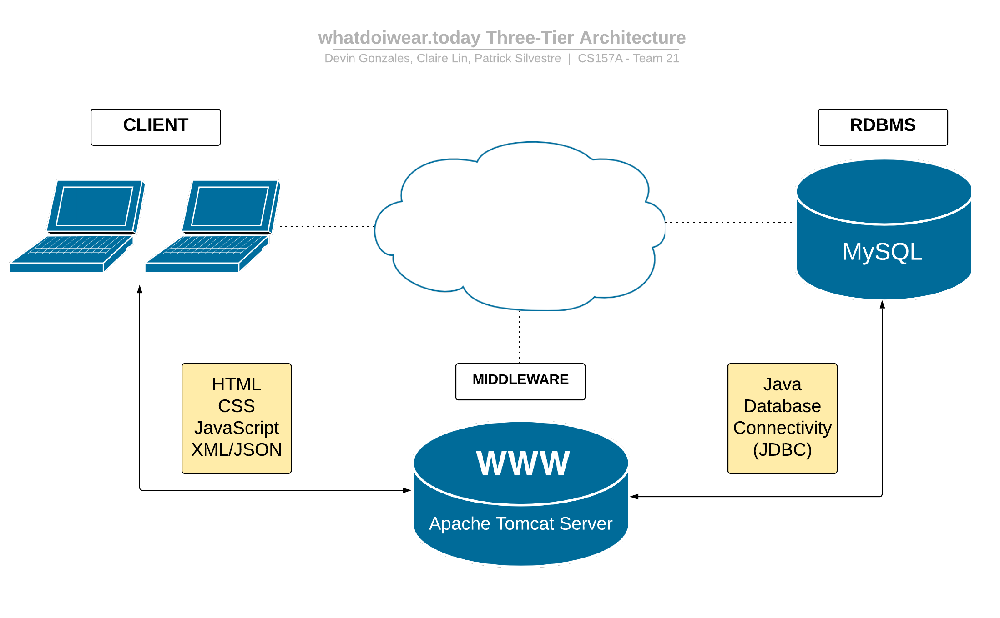

# whatdoiwear.today - Project Proposal
## Team 21
* [Devin Gonzales](https://github.com/DJGonzales96)
* [Claire Lin](https://github.com/clairelin23)
* [Patrick Silvestre](https://github.com/pjsilvestre)

## Project Overview
whatdoiwear.today is a tool that helps you organize your closet, from shirts to socks to everything in between. You are interested in organizing your wardrobe in multiple ways, whether you want to see all pieces from a certain brand, pieces made from a certain material, and more. whatshouldiwear.today makes your life more coordinated as you up your fashion game.

How we look and how we dress are important parts of daily life. From casual to business settings, it's important to project the image and appearance you feel best represents your style. Physical closets are limited in capacity by size and space and can quickly grow unorganized or frustrating to navigate. In a world with an ever growing plethora of clothing options, whatdoiwear.today offers a virtually limitless storage for all your fashion wants and needs. Build towards a wardrobe completely of your choosing, with various filtering options to cater to your personal organizational needs. Save time and search for individual clothing items instantly. Whether you are a professional fashionista or a growing collector, whatdoiwear.today helps you dress to impress.

### Goals
* To provide a user-friendly application that allows seamless organization of a virtual wardrobe.
* To accommodate the increased spending by youth on apparel with an application to represent and share their personal style.
* To utilize relational databases for efficient searching and sorting queries within the application.
* To provide a GUI component to drive user interaction that is both visually appealing and easy to use.

### Target Audience
* Students/Young Adults
    * The highest percentage of annual income of many students and young adults are spent on clothes. 
* Women
    * Ladies spend a disproportionately higher amount on apparel than similarly aged men.
* Professionals
    * Industry designers that could benefit from a supplemental platform to organize and catalogue their brands, designs and ideas.

## System Environment

whatdoiwear.today is based on a three-tier architecture. The application can be accessed on the web from any local PC and is displayed to the user via a combination of Java, HTML, CSS, and JavaScript. A relational database using in MySQL stores the user information and collects data to be displayed. Apache Tomcat servers ensure that the highest and lowest tiers of the architecture can communicate at all times to allow for smooth access.

## Functional Requirements
### Account Creation and Login
A user should be able to create an account to uniquely link them to their closet.

### Adding Pieces
A user should be able to add new pieces of clothing to their closet. They should be prompted to input the type (e.g. t-shirt), brand, material, and when they last wore the piece.

### Viewing the Closet
A user should be able to view and sort their closet in different ways, such as based on type, brand, material, and when the piece was last worn.

### Updating Pieces
A user should be able to freely update the information associated with a piece of clothing, whether it be updating when a piece was last worn to fixing incorrect entries.

### Removing Pieces
A user should be able to remove pieces from their closet.

## Non-Functional Issues

### Device Support
A user should be able to access a functional application on local PC (e.g. desktop, laptop).

### Performance
Basic application I/O operations and queries should succeed with a fast response time.

### Scalability
The application should be structured to allow for scalability for large data sets.

### Capacity
A user should be able to store a sufficient amount of clothes in their closet or wardrobe.

### Recoverability
A user's closet should retain the the same data/clothing items in between individual sessions.

### Security
User information should remain confidential with securely stored information via user accounts.

### Usability 
The application should be accessible and easy to use with clear instruction provided for non-trivial use cases. The application should have an aesthetically pleasing user interface design that helps engage users to encourage long-term usage of the app.

### Installability
The application should be able to be installed, uninstalled, or reinstalled into a target environment.

### Responsive Design
The application's graphical user interface should be able to adapt to different webpage environments, specifically, responding to the display size of a users PC, from laptops to desktops.
